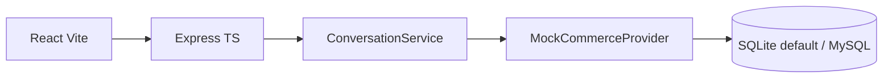

# Voice Commerce AI Agent

> Production-style voice commerce assistant — all 7 phases complete. Mock commerce + browser voice run with zero API keys.

## 1. Project Overview
Voice-first e-commerce assistant: voice → STT (browser, Phase 1) → conversation + keyword intent → mock commerce tools → voice-optimized reply → TTS (browser).

## 2. Problem Statement
Customers prefer speaking over typing filters. LLM must understand intent but never invent price/inventory — backend is authoritative.

## 3. Features (Phase 1 done)
- [x] Product search API (category, price, color, brand, text)
- [x] Product details + inventory endpoints
- [x] Conversations with session context across turns (merged entities + last-10-turn history)
- [x] LLM integration: `LLMProvider` seam — `GeminiProvider` (`gemini-1.5-flash`, JSON-mode intent extraction + voice replies) when `GOOGLE_API_KEY` is set, deterministic `KeywordProvider` fallback otherwise/offline
- [x] Modular prompts: `prompts/system.prompt.ts` (identity + never-invent/never-calculate rules) + `prompts/voice.prompt.ts` (short, 1 question, English-only, TTS-optimized) + `EXTRACTION_PROMPT`
- [x] Full tool-calling: `tools/tools.ts` registry (`searchProducts`, `getProductDetails`, `checkInventory`, `calculatePrice`, `getOrderStatus`), all Zod-validated; Gemini picks tool+args via `decideTool()` + `GEMINI_TOOL_DECLARATIONS` (parity test prevents drift), registry executes
- [x] Deterministic pricing service: subtotal/discount/shipping/total, `SUMMER10` = 10%, flat ₹100 shipping (free over ₹20,000); spec example verified: 5998 − 599.8 + 100 = 5498.2. LLM never computes prices.
- [x] Orders service + `GET /api/orders/:id`; `POST /api/pricing/calculate` with 400/404 error codes (`INVALID_DISCOUNT`, `INVALID_PRODUCT`, `INVALID_QUANTITY`)
- [x] Variable localization service: `renderTemplate('Hi {{customer_name}}…')` + `formatINR`, used by voice replies; reports missing vars
- [x] Voice endpoints: `POST /api/voice/transcribe` (cloud STT or honest 501 → browser fallback) + `POST /api/voice/respond` (full pipeline, auto-creates conversations, TTS-optimized `voiceText`, per-turn `latency`); conversation logic extracted to `services/conversationService.ts` shared by both routes
- [x] TTS optimizer: spoken currency (English), strips markdown/links/emoji/symbols, ≤3 sentences / 60 words; per-message latency chips in UI (stt/llm/tool/tts/total)
- [x] Spoken details flow: `product_details` intent + affirmative follow-ups ("tell me more" → `getProductDetails` of last offered item, 2-sentence spoken summary, no repeats); stale-product guard when category switches mid-conversation
- [x] Honest stock turns: out-of-stock sizes (e.g. P100 size 10) get clear English replies with alternatives
- [x] Observability: PII-free `voice_turn` structured logs (`conversation_id, intent, tool_called, *_latency_ms, success`) + in-memory rolling stats at `GET /api/voice/stats` (avg/p50/p95 per stage, by-tool counts)
- [x] Shopify seam: extended `CommerceProvider` (orders/customers/discounts); pricing + orders + discount-matching now read through the provider; real `ShopifyProvider` (Admin REST, see §12) auto-selected on credentials, mock otherwise
- [x] Production quality: `x-api-key` gate on ops endpoints, Dockerfiles + compose (client nginx + server + mysql), CI workflow, `trust proxy`, per-route voice quota, security audit (§14)
- [ ] Live verification with cloud keys / real Shopify store (needs credentials)

## 4. Architecture


## 5. Voice Pipeline (Phase 4)
Browser `SpeechRecognition (en-IN)` → `POST /api/voice/respond {text, conversationId?, sttLatencyMs?}` → shared conversation pipeline → `optimizeForSpeech()` → `speechSynthesis` speaks `voiceText`. `POST /api/voice/transcribe {audioBase64}` handles cloud STT when `STT_PROVIDER=deepgram|whisper` + key is set; otherwise 501 `{fallback: 'browser-stt'}`. Provider seams: `services/speech/` — `STTProvider`/`TTSProvider` interfaces, `getSTTProvider()`/`getTTSProvider()` factories (`Unavailable`/`Browser` default, `Deepgram`/`Whisper`/`ElevenLabs` real-HTTP impls, live-untested without keys). Every turn returns `latency: {sttMs, llmMs, toolMs, ttsMs, totalMs}`, rendered under each assistant message.

## 6. Tech Stack
Client: React 18 + TS + Vite. Server: Node + Express + TS, Zod, Helmet, CORS, rate-limit, Pino. DB: SQLite (`better-sqlite3`, default) / MySQL 8 (`mysql2`, `DB_PROVIDER=mysql`). Tests: Vitest + Supertest.

## 7. Backend Architecture
`routes/` thin → `services/commerce/` (`CommerceProvider`, `MockCommerceProvider`, `ShopifyProvider` stub) → `db/database.ts`. No business logic in handlers.

## 8. Database Schema
`users, products, product_variants, inventory, discounts, orders, order_items (future), conversations, conversation_messages`. FKs on product/order/message relations. Seed: 8 products, sizes 7–10, `SUMMER10`, order `KW12345`.

## 9. API Documentation
- `GET /api/health`
- `GET /api/products?category=&maxPrice=&minPrice=&color=&brand=&q=&limit=`
- `GET /api/products/:id`
- `GET /api/products/:id/inventory?size=`
- `POST /api/pricing/calculate` `{productId, quantity, discountCode?}` → `{unitPrice, subtotal, discount, shipping, total}`
- `GET /api/orders/:id` → `{orderId, status, estimatedDelivery, total}`
- `POST /api/conversations` → `{ conversationId }`
- `POST /api/conversations/:id/messages` `{text}` → `{ reply, products, filters, intent, meta }`
- `POST /api/voice/transcribe` `{audioBase64, mimeType?, language?}` → `{text, language, confidence?, sttLatencyMs}` or 501 `{fallback: 'browser-stt'}`
- `POST /api/voice/respond` `{text, conversationId?, voice?, sttLatencyMs?}` → `{conversationId, reply, voiceText, audioBase64?, products, filters, intent, latency, meta}`
- `GET /api/conversations/:id/messages`

## 10. Tool Calling
`tools/tools.ts` is the single registry: Zod schema + `execute` per tool, invoked by both the keyword fallback router and Gemini `decideTool()` function-calling (`tools/geminiDeclarations.ts`, parity-tested). Flow: user → LLM (picks tool+args) → registry (validates + executes against commerce/pricing/orders services) → DB → LLM (phrases) → voice reply. Business data never originates from the LLM.

## 11. Prompt Engineering
`server/src/prompts/system.prompt.ts` (identity, LLM owns intent/entities/context/replies; backend owns all business data) + `server/src/prompts/voice.prompt.ts` (`VOICE_PROMPT`: ≤3 sentences, one question, spoken currency, max 3 options cheapest-first; `EXTRACTION_PROMPT`: strict JSON schema with English examples). Without a key, deterministic English templates produce the same shape.

## 12. Shopify Integration
`CommerceService` → `CommerceProvider` interface (`searchProducts`, `getProduct`, `getInventory`, `getOrder`, `getCustomer`, `getDiscount`) with two implementations:

- **`MockCommerceProvider`** (default): local SQLite/MySQL seed data. Used whenever `SHOPIFY_STORE_URL`/`SHOPIFY_ACCESS_TOKEN` are unset — the app, demo, and all tests run on this.
- **`ShopifyProvider`** (`services/commerce/ShopifyProvider.ts`): real Shopify **Admin REST API** calls via plain `fetch` (8s timeout, no SDK), selected automatically when credentials are set. Pricing, orders, and discount matching all go through the provider seam, so switching sources changes no conversational code.

| Our operation | Shopify API | Mapping notes |
|---|---|---|
| `searchProducts` | `GET /products.json?limit=250` | `category`←`product_type`, `color`←Color option/tag, `brand`←`vendor`; price/text filters applied client-side, cheapest-first |
| `getProduct` | `GET /products/{id}.json` | HTML stripped from `body_html`; price = min variant price |
| `getInventory` | variants' `inventory_quantity` | size matched against variant option values (case-insensitive) |
| `getOrder` | `GET /orders/{id}.json` or `GET /orders.json?name=` | numeric ids direct; otherwise order-name lookup (`#1001`) |
| `getCustomer` | `GET /customers/{id}.json` | id + full name |
| `getDiscount` | `GET /price_rules.json` + `/price_rules/{id}/discount_codes.json` | percentage rules only; fixed-amount codes return `null` → `INVALID_DISCOUNT` voice reply |

Setup: create a Shopify dev store → Apps → custom app with `read_products`, `read_inventory`, `read_orders`, `read_customers`, `read_discounts` → set `SHOPIFY_STORE_URL=https://<store>.myshopify.com`, `SHOPIFY_ACCESS_TOKEN`, `SHOPIFY_API_VERSION=2024-10`. Auth failures surface as `SHOPIFY_AUTH` (token never logged). Live-untested without store credentials — `tests/shopify.test.ts` covers mapping, filtering, and error paths against a stubbed API. Honest status: default install uses the mock provider.

## 13. STT/TTS Integration
Browser-first: mic → Web Speech API (`en-IN`), replies via `speechSynthesis` speaking server-optimized `voiceText`. Server seams in `services/speech/`: `STTProvider` (Deepgram Nova / Whisper, selected by `STT_PROVIDER` + key) and `TTSProvider` (ElevenLabs multilingual, `TTS_PROVIDER=elevenlabs` + key). `optimizeForSpeech()` is deterministic and unit-tested: spoken currency (₹2,499 → "2,499 rupees"), strips markdown/links/emoji, ≤3 sentences / 60 words. Set `STT_PROVIDER`/`TTS_PROVIDER` + keys in `.env` (see `.env.example`); without keys the app runs fully on browser voice.

## 14. Security
Helmet headers, CORS allowlist (`CORS_ORIGIN`), global rate limit (120 req/min) + stricter voice quota (60 req/min, audio/LLM turns are expensive), `trust proxy` for accurate client IPs behind nginx, Zod validation on every input (message text ≤2000 chars, audio ≤2.5MB base64, JSON body ≤2MB), generic voice-safe error messages (no stack traces), PII-free logs, secrets only via env (`.env` never committed, `.env.example` documents all keys). Ops endpoints (`GET /api/voice/stats`) require `x-api-key` when `API_KEY` is set; demo endpoints stay open for local use. CI (`.github/workflows/ci.yml`) runs lint + build + tests on every push/PR.

## 15. Testing
`npm test --workspace=server` (40 tests): health, search filters, invalid input, inventory shape, multi-turn context, order/inventory/price/details intents, latency meta, keyword extractor units, prompt rules, pricing (normal/discount/multi-qty/shipping-threshold/invalid), registry execution + validation, Gemini declaration parity, localization, orders/pricing REST, TTS optimizer units, transcribe 501 fallback, voice/respond pipeline + latency shape, details follow-up, out-of-stock honesty, stats aggregation + API-key gating, Shopify mapping/filter/error paths (stubbed fetch).

## 16. Latency/Performance
Every voice turn returns `latency: {sttMs, llmMs, toolMs, ttsMs, totalMs}` (browser-measured STT + server timings), rendered per assistant message. `GET /api/voice/stats` aggregates server-side stages (avg/p50/p95, by-tool counts, errors) over a 500-turn rolling window. Example offline turn: stt ~400ms (mic listen), llm ~0ms (keyword), tool ~2ms (sqlite), tts ~0ms (text optimize), total ~50ms + network. SQLite `busy_timeout=5000` guards concurrent turns. PII-free `voice_turn` logs carry the same fields for external aggregation.

## 17. Environment Variables
See `.env.example`. Local demo needs only `PORT`, `CORS_ORIGIN`, `DB_PROVIDER`, `SQLITE_PATH`. Optional upgrades: `GOOGLE_API_KEY` (Gemini), `STT_PROVIDER` + `DEEPGRAM_API_KEY`/`OPENAI_API_KEY`, `TTS_PROVIDER=elevenlabs` + keys, `SHOPIFY_*` (real store), `API_KEY` (protects `/api/voice/stats`), `MYSQL_*` with `DB_PROVIDER=mysql`.

## 18. Local Setup
```bash
npm install
npm run dev --workspace=server  # :3001 (SQLite auto-seeds)
npm run dev --workspace=client  # :5173
# MySQL (optional): docker compose up -d, DB_PROVIDER=mysql npm run dev --workspace=server
npm test --workspace=server
```
Docker (needs Docker Engine; not verified on machines without it):
```bash
docker compose up --build  # client :8080 (nginx, /api proxied), server :3001
```
Try: "I need running shoes" → "Under 3000, black ones".

## 19. Screenshots
_No screenshots committed — capture from the running app (`npm run dev --workspace=client`, Chrome for mic support): the voice card with mic states, an assistant turn with latency chips (`stt/llm/tool/tts/total`), and product cards. PRs adding `docs/screenshot-*.png` + links here are welcome._

## 20. Future Improvements
Phase 4: cloud STT/TTS. Phase 5: TTS optimizer + latency dashboard. Phase 6: real Shopify. Phase 7: auth, Docker, CI.

## Appendix — Verified Phase-2 conversation (no key, keyword fallback)
`I need running shoes` → product_search → *"I found 3 options. Cheapest is ₹1,799…"*
`3000 ke andar` → context merged (category kept) → same 3 options under ₹3,000
`Is it available in size 9?` → checkInventory → *"Yes, it's available — 8 in stock…"*
`Where is my order KW12345?` → getOrderStatus → *"Your order has been shipped…"*
Set `GOOGLE_API_KEY` (+ optional `GEMINI_MODEL`) to route extraction + reply phrasing through Gemini; backend data stays authoritative either way.
