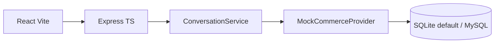

# Voice Commerce AI Agent

> Production-style voice commerce assistant. Mock commerce + browser voice run with zero API keys; cloud providers (Groq/Gemini, Deepgram, ElevenLabs, Shopify) plug in via env. See §21 for honest limitations.

## 1. Project Overview
Voice-first e-commerce assistant: voice → STT (browser by default, Deepgram/Whisper when configured) → LLM intent + function-calling (Groq/Gemini, keyword fallback offline) → validated backend tools → deterministic pricing/inventory/orders → voice-optimized reply → TTS (browser by default, ElevenLabs when configured).

## 2. Problem Statement
Customers prefer speaking over typing filters. LLM must understand intent but never invent price/inventory — backend is authoritative.

## 3. Features
- [x] Product search API (category, price, color, brand, text)
- [x] Product details + inventory endpoints
- [x] Conversations with session context across turns (merged entities + last-10-turn history)
- [x] LLM integration: `LLMProvider` seam — `GroqProvider` (`openai/gpt-oss-120b`, OpenAI-compatible JSON mode + function calling) when `GROQ_API_KEY` is set, `GeminiProvider` (`gemini-3.6-flash`) when `GOOGLE_API_KEY` is set, deterministic `KeywordProvider` fallback otherwise/offline. Ordered chain (Groq → Gemini → keyword, first success per stage wins; explicit `LLM_PROVIDER` pins one). Each turn costs one LLM call; LLM errors are logged with provider + reason.
- [x] Merchant profiles: per-merchant variables (`services/merchants/`) — language (`en` default, `hinglish` opt-in), tone, greeting, STT locale — injected into prompts, reply templates, and TTS formatting. Reusable `languagePacks` keep prompt hygiene centralized instead of branching inline.
- [x] Knowledge retrieval (RAG-lite): `searchKnowledge` tool over merchant policy docs with deterministic BM25-style TF-IDF scoring (no vector DB at this scale; swappable interface), answers grounded in retrieved chunks. Try: "What is your return policy?"
- [x] Call-quality loop: `scripts/call_quality.py` (stdlib-only Python) reviews `voice_turn` JSONL logs — fallback rate, per-stage avg/p50/p95, top intents/tools, slowest turns to replay.
- [x] Modular prompts: `prompts/system.prompt.ts` (identity + never-invent/never-calculate rules) + `prompts/voice.prompt.ts` (short, 1 question, merchant-language, TTS-optimized) + `EXTRACTION_PROMPT`
- [x] Full tool-calling: `tools/tools.ts` registry (`searchProducts`, `getProductDetails`, `checkInventory`, `calculatePrice`, `getOrderStatus`, `placeOrder`, `searchKnowledge`), all Zod-validated; Groq/Gemini pick tool+args via function-calling (parity-tested declarations), registry executes
- [x] Checkout with mandatory confirmation: buy request → deterministic pricing → staged `pendingOrder` → explicit yes → `placeOrder` (stock decremented, order + items persisted). The pipeline structurally downgrades any unconfirmed model `placeOrder` to staging, so no prompt slip can order without a yes; topic switches void stale pendings. `POST /api/orders` exposes the same flow.
- [x] Deterministic pricing service: subtotal/discount/shipping/total, `SUMMER10` = 10%, flat ₹100 shipping (free over ₹20,000); spec example verified: 5998 − 599.8 + 100 = 5498.2. LLM never computes prices.
- [x] Orders service + `GET /api/orders/:id`; `POST /api/pricing/calculate` with 400/404 error codes (`INVALID_DISCOUNT`, `INVALID_PRODUCT`, `INVALID_QUANTITY`)
- [x] Variable localization service: `renderTemplate('Hi {{customer_name}}…')` + `formatINR`, used by voice replies; reports missing vars
- [x] Voice endpoints: `POST /api/voice/transcribe` (cloud STT or honest 501 → browser fallback) + `POST /api/voice/respond` (full pipeline, auto-creates conversations, TTS-optimized `voiceText`, per-turn `latency`); conversation logic extracted to `services/conversationService.ts` shared by both routes
- [x] TTS optimizer: spoken currency (rupees/rupaye per merchant), strips markdown/links/emoji/symbols, ≤3 sentences / 60 words, decimal-safe; per-message latency chips in UI (stt/llm/tool/tts/total); stop-speech button + mic barge-in; merchant selector (English/Hinglish store)
- [x] Spoken details flow: `product_details` intent + affirmative follow-ups ("tell me more" → `getProductDetails` of last offered item, 2-sentence spoken summary, no repeats); stale-product guard when category switches mid-conversation
- [x] Honest stock turns: out-of-stock sizes (e.g. P100 size 10) get clear replies with alternatives, in the merchant language
- [x] Observability: PII-free `voice_turn` structured logs (`conversation_id, intent, tool_called, *_latency_ms, success`) + in-memory rolling stats at `GET /api/voice/stats` (avg/p50/p95 per stage, by-tool counts)
- [x] Shopify seam: extended `CommerceProvider` (orders/customers/discounts); pricing + orders + discount-matching now read through the provider; real `ShopifyProvider` (Admin REST, see §12) auto-selected on credentials, mock otherwise
- [x] Production quality: `x-api-key` gate on ops endpoints, Dockerfiles + compose (client nginx + server + mysql), CI workflow, `trust proxy`, per-route voice quota, security audit (§14)
- [ ] Live verification with cloud keys / real Shopify store (needs credentials) — tracked in GitHub issue #1

## 3b. Voice-AI role skill mapping
| Role requirement | Where it lives |
|---|---|
| Voice-tailored prompts (sentence length, TTS punctuation) | `prompts/voice.prompt.ts`, `services/speech/optimizer.ts` (≤3 sentences/60 words, spoken currency, symbol stripping) |
| Hinglish switching | `services/merchants/` profile + `localization/languagePacks.ts` (per-merchant `en`/`hinglish`, verified live) |
| Per-merchant prompt variables | `MerchantProfile` (language, tone, greeting, STT locale) injected into prompts, templates, TTS |
| Reusable conversation flows | intent router + `conversationService.ts` (search → details → stock → price → confirm → track), templates centralized in packs |
| Shopify + REST data | `CommerceProvider` seam + `ShopifyProvider` (Admin REST, §12) |
| Variable localization, price computation | `localization/` (`renderTemplate`, `formatINR`), `pricing/calc.ts` (deterministic breakup) |
| Test-listen-iterate loop | `voice_turn` logs + `GET /api/voice/stats` + `scripts/call_quality.py` (fallback rate, p50/p95, replays) |
| GenAI/LLM/RAG | Groq + Gemini function-calling; `searchKnowledge` retrieval-grounded policy answers (lexical TF-IDF, swappable) |
| Python backend scripting | `scripts/call_quality.py` (stdlib-only log analytics) |

## 4. Architecture


## 5. Voice Pipeline
Browser `SpeechRecognition` (`en-IN`, or `hi-IN` for the Hinglish merchant) → `POST /api/voice/respond {text, conversationId?, merchantId?, sttLatencyMs?}` → shared conversation pipeline → `optimizeForSpeech()` → `speechSynthesis` speaks `voiceText` (or cloud audio when ElevenLabs is configured and working). `POST /api/voice/transcribe {audioBase64}` handles cloud STT when `STT_PROVIDER=deepgram|whisper` + key is set; otherwise 501 `{fallback: 'browser-stt'}`. Provider seams: `services/speech/` — `STTProvider`/`TTSProvider` interfaces, `getSTTProvider()`/`getTTSProvider()` factories (`Unavailable`/`Browser` default, `Deepgram`/`Whisper`/`ElevenLabs` real-HTTP impls). Every turn returns `latency: {sttMs, llmMs, toolMs, ttsMs, totalMs}`, rendered under each assistant message.

## 6. Tech Stack
Client: React 18 + TS + Vite. Server: Node 22+ + Express + TS, Zod, Helmet, CORS, rate-limit, Pino. DB: SQLite via Node's built-in `node:sqlite` (zero native deps) by default / MySQL 8 (`mysql2`, `DB_PROVIDER=mysql`). Tests: Vitest + Supertest. Scripts: Python 3 stdlib-only (`scripts/call_quality.py`).

## 7. Backend Architecture
`routes/` thin → `services/conversationService.ts` (pipeline: extract → route → tools → reply) → `services/commerce/` (`CommerceProvider`, `MockCommerceProvider`, `ShopifyProvider`) → `db/database.ts`. No business logic in handlers.

## 8. Database Schema
`users, products, product_variants, inventory, discounts, orders, order_items, conversations, conversation_messages`. FKs on product/order/message relations. Seed: 8 products, sizes 7–10, `SUMMER10`, order `KW12345`.

## 9. API Documentation
- `GET /api/health`
- `GET /api/products?category=&maxPrice=&minPrice=&color=&brand=&q=&limit=`
- `GET /api/products/:id`
- `GET /api/products/:id/inventory?size=`
- `POST /api/pricing/calculate` `{productId, quantity, discountCode?}` → `{unitPrice, subtotal, discount, shipping, total}`
- `POST /api/orders` `{productId, size?, quantity?, discountCode?, customerId?}` → `201 {orderId, status, productName, subtotal, discount, shipping, total}` (400/404/409 coded errors)
- `POST /api/conversations` → `{ conversationId }`
- `POST /api/conversations/:id/messages` `{text, merchantId?}` → `{ reply, products, filters, intent, meta }`
- `POST /api/voice/transcribe` `{audioBase64, mimeType?}` → `{text, confidence?, sttLatencyMs}` or 501 `{fallback: 'browser-stt'}`
- `POST /api/voice/respond` `{text, conversationId?, merchantId?, voice?, sttLatencyMs?}` → `{conversationId, reply, voiceText, audioBase64?, ttsFallback, products, filters, intent, latency, meta}`
- `GET /api/conversations/:id/messages`

## 10. Tool Calling
`tools/tools.ts` is the single registry: Zod schema + `execute` per tool, invoked by both the keyword fallback router and Groq/Gemini `decideTool()` function-calling (parity-tested declarations in both formats). Flow: user → LLM (picks tool+args) → registry (validates + executes against commerce/pricing/orders/knowledge services) → DB → LLM (phrases) → voice reply. Business data never originates from the LLM.

## 11. Prompt Engineering
`server/src/prompts/system.prompt.ts` (identity, LLM owns intent/entities/context/replies; backend owns all business data) + `server/src/prompts/voice.prompt.ts` (`VOICE_PROMPT`: ≤3 sentences, one question, spoken currency, max 3 options cheapest-first; `EXTRACTION_PROMPT`: strict JSON schema with English examples). Without a key, deterministic merchant-language templates produce the same shape.

## 12. Shopify Integration
`CommerceService` → `CommerceProvider` interface (`searchProducts`, `getProduct`, `getInventory`, `getOrder`, `getCustomer`, `getDiscount`) with two implementations:

- **`MockCommerceProvider`** (default): local SQLite/MySQL seed data. Used whenever `SHOPIFY_STORE_URL`/`SHOPIFY_ACCESS_TOKEN` are unset — the app, demo, and all tests run on this.
- **`ShopifyProvider`** (`services/commerce/ShopifyProvider.ts`): real Shopify **Admin REST API** calls via plain `fetch` (8s timeout, no SDK), selected automatically when credentials are set. Pricing, orders, and discount matching all go through the provider seam, so switching sources changes no conversational code.

| Our operation | Shopify API | Mapping notes |
|---|---|---|
| `searchProducts` | `GET /products.json?limit=250` | `category`←`product_type`, `color`←Color option/tag, `brand`←`vendor`; price/text filters applied client-side, cheapest-first |
| `getProduct` | `GET /products/{id}.json` | HTML stripped from `body_html`; price = min variant price |
| `getInventory` | variants' `inventory_quantity` | size matched against variant option values (case-insensitive) |
| `getOrder` | `GET /orders/{id}.json` or `GET /orders.json?name=` | numeric ids direct; otherwise order-name lookup (`#1001`) |
| `getCustomer` | `GET /customers/{id}.json` | id + full name |
| `getDiscount` | `GET /price_rules.json` + `/price_rules/{id}/discount_codes.json` | percentage rules only; fixed-amount codes return `null` → `INVALID_DISCOUNT` voice reply |

Setup: create a Shopify dev store → Apps → custom app with `read_products`, `read_inventory`, `read_orders`, `read_customers`, `read_discounts` → set `SHOPIFY_STORE_URL=https://<store>.myshopify.com`, `SHOPIFY_ACCESS_TOKEN`, `SHOPIFY_API_VERSION=2024-10`. Auth failures surface as `SHOPIFY_AUTH` (token never logged). Live-untested without store credentials — `tests/shopify.test.ts` covers mapping, filtering, and error paths against a stubbed API. Honest status: default install uses the mock provider.

## 13. STT/TTS Integration
Browser-first: mic → Web Speech API (`en-IN`), replies via `speechSynthesis` speaking server-optimized `voiceText`. Server seams in `services/speech/`: `STTProvider` (Deepgram Nova / Whisper, selected by `STT_PROVIDER` + key) and `TTSProvider` (ElevenLabs multilingual, `TTS_PROVIDER=elevenlabs` + key). If cloud TTS fails (e.g. ElevenLabs free plans block library voices via API), the turn still returns 200 with `ttsFallback: true` and the browser speaks `voiceText` — cloud failures never kill a conversation. `optimizeForSpeech()` is deterministic and unit-tested: spoken currency (₹2,499 → "2,499 rupees"), strips markdown/links/emoji, ≤3 sentences / 60 words. Set `STT_PROVIDER`/`TTS_PROVIDER` + keys in `.env` (see `.env.example`); without keys the app runs fully on browser voice.

## 14. Security
Helmet headers, CORS allowlist (`CORS_ORIGIN`), global rate limit (120 req/min) + stricter voice quota (60 req/min, audio/LLM turns are expensive), `trust proxy` for accurate client IPs behind nginx, Zod validation on every input (message text ≤2000 chars, audio ≤2.5MB base64, JSON body ≤2MB), generic voice-safe error messages (no stack traces), PII-free logs, secrets only via env (`.env` never committed, `.env.example` documents all keys). Ops endpoints (`GET /api/voice/stats`) require `x-api-key` when `API_KEY` is set; demo endpoints stay open for local use. CI (`.github/workflows/ci.yml`) runs lint + build + tests on every push/PR.

## 15. Testing
`npm test --workspace=server` (64 tests): health, search filters, invalid input, inventory shape, multi-turn context, order/inventory/price/details/knowledge intents, latency meta, keyword extractor units, prompt rules, pricing (normal/discount/multi-qty/shipping-threshold/invalid), registry execution + validation, declaration parity (Gemini + OpenAI), localization + language packs, merchant profiles, orders/pricing REST, TTS optimizer units, transcribe 501 fallback, voice/respond pipeline + latency shape, details follow-up, out-of-stock honesty, checkout + confirmation guard, stats aggregation + API-key gating, Shopify mapping/filter/error paths (stubbed fetch).

## 16. Latency/Performance
Every voice turn returns `latency: {sttMs, llmMs, toolMs, ttsMs, totalMs}` (browser-measured STT + server timings), rendered per assistant message. `GET /api/voice/stats` aggregates server-side stages (avg/p50/p95, by-tool counts, errors) over a 500-turn rolling window. Example offline turn: stt ~400ms (mic listen), llm ~0ms (keyword), tool ~2ms (sqlite), tts ~0ms (text optimize), total ~50ms + network. SQLite `busy_timeout=5000` guards concurrent turns. PII-free `voice_turn` logs carry the same fields for external aggregation.

## 17. Environment Variables
See `.env.example`. Local demo needs only `PORT`, `CORS_ORIGIN`, `DB_PROVIDER`, `SQLITE_PATH`. Optional upgrades: `GROQ_API_KEY` (Groq LLM, preferred for low-latency voice) or `GOOGLE_API_KEY` (Gemini), `STT_PROVIDER` + `DEEPGRAM_API_KEY`/`OPENAI_API_KEY`, `TTS_PROVIDER=elevenlabs` + keys, `SHOPIFY_*` (real store), `API_KEY` (protects `/api/voice/stats`), `MYSQL_*` with `DB_PROVIDER=mysql`.

## 18. Local Setup
```bash
npm install
npm run dev --workspace=server  # :3001 (SQLite auto-seeds)
npm run dev --workspace=client  # :5173
# MySQL (optional): docker compose up -d, DB_PROVIDER=mysql npm run dev --workspace=server
npm test --workspace=server
```
Docker (needs Docker Engine; not verified on machines without it):
```bash
docker compose up --build  # client :8080 (nginx, /api proxied), server :3001
```
Try: "I need running shoes" → "Under 3000, black ones".

## 19. Screenshots
_No screenshots committed — capture from the running app (`npm run dev --workspace=client`, Chrome for mic support): the voice card with mic states, an assistant turn with latency chips (`stt/llm/tool/tts/total`), and product cards. PRs adding `docs/screenshot-*.png` + links here are welcome._

## 20. Future Improvements
- **Real Shopify store** (tracked in issue #1): connect a dev store, verify search/inventory/pricing/draft-orders live, fix mapping gaps the real data exposes.
- **Cloud voice verification**: ElevenLabs audio path needs a paid plan or custom voice (free tier blocks library voices — verified 402); Deepgram key auth verified but real mic audio never tested through `/voice/transcribe`.
- **Payments**: checkout currently confirms and persists orders with no payment step — a real deployment needs a payment provider (e.g. Razorpay/Stripe) before `placeOrder` means anything financial.
- **Persistence hardening**: sessions, pending orders, and latency stats are in-memory (lost on restart, single instance). Move to MySQL/Redis when deploying beyond demo.
- **Scale-ups if traffic justifies**: DB-backed merchant profiles + admin UI (currently 2 hardcoded profiles), vector embeddings for knowledge retrieval (currently lexical TF-IDF over 5 docs), MySQL + Docker paths verified (unimplemented locally — no Docker Engine here).

## 21. Known limitations (honest status)
- **Mock catalog of 8 products** by default — anything outside it returns "nothing found," regardless of LLM smarts. Data problems need Shopify (#1), not a better model.
- **Free-tier ceilings already hit during development**: Gemini 429 quota (Groq is primary for this reason), ElevenLabs library voices blocked via API (automatic browser-TTS fallback with `ttsFallback: true`).
- **LLM non-determinism**: cloud models occasionally pick odd tools/args (observed: `limit: 20` rejected by validation, "size 9" read as quantity 9). Mitigated by strict Zod validation, the placeOrder confirmation guard, and hermetic tests pinned to the keyword path (live behavior covered by smoke tests, not CI).
- **MySQL and Docker artifacts are untested** — this machine has neither a MySQL server nor Docker Engine. SQLite is the verified path.
- **No auth on demo endpoints** by default; only `/api/voice/stats` is key-gated (when `API_KEY` is set). Not multi-tenant: one shared catalog, no per-user carts.

## Appendix — Verified conversation (Groq live, English merchant)
`Show me running shoes under 3000` → searchProducts → *"I found 3 options. Cheapest is ₹1,799…"*
`Which of these is the cheapest?` → getProductDetails → spoken summary of the cheapest
`Is it available in size 9?` → checkInventory (resolved from context) → *"Yes, we have size 9 in stock…"*
`I want to buy the Campus North Plus in size 9` → staged pending → *"say yes to confirm?"* → `Yes` → order `KW…` confirmed
`Where is my order KW12345?` → getOrderStatus → *"Your order has been shipped…"*
Hinglish merchant (`merchantId: demo_hinglish`): same flows reply in Hinglish with `rupaye` TTS text.
Backend data stays authoritative either way; cloud LLM failures fall back per-turn with `ttsFallback`/keyword paths intact.
